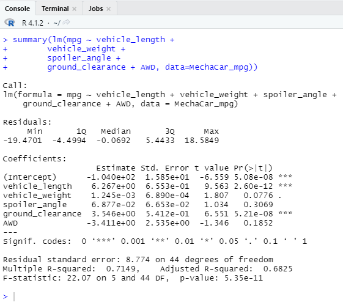

# MechaCar_Statistical_Analysis

## Overview

This project is created to assist AutosRUs' management team to determine the possible causes of production troubles that are blocking manufacturing team's progress. In this project the following tests have been performed:

- multiple linear regression analysis to identify which variables in the dataset predict the mpg of MechaCar prototypes
- Collect summary statistics on the pounds per square inch (PSI) of the suspension coils from the manufacturing lots
- Run t-tests to determine if the manufacturing lots are statistically different from the mean population
- Design a statistical study to compare vehicle performance of the MechaCar vehicles against vehicles from other manufacturers.

## Results

### Linear Regression to Predict MPG

The `MechaCar_mpg.csv` dataset contains mpg test results for 50 prototype MechaCars. The MechaCar prototypes were produced using multiple design specifications to identify ideal vehicle performance. Multiple metrics, such as vehicle length, vehicle weight, spoiler angle, drivetrain, and ground clearance, were collected for each vehicle. Here is a linear model that predicts the mpg of MechaCar prototypes using several variables from the `MechaCar_mpg.csv` file. 

- Which variables/coefficients provided a non-random amount of variance to the mpg values in the dataset?

  *According to the summary statistics, vehicle length and ground_clearance(as well as intercept) are statistically unlikely to provide random amounts of variance to the linear model. In other words, vehicle length and ground_clearance have a significant impact on mpg.*

- Is the slope of the linear model considered to be zero? Why or why not?

  *The p-value = 5.35 x 10**(-11) which is much smaller than the significance level of 0.05. Therefore, there is sufficient evidence to reject our null hypothesis, which means that the slope of our linear model is not zero.*

- Does this linear model predict mpg of MechaCar prototypes effectively? Why or why not?

  *The r-squared value = 0.7149 which means roughly 71% of the variability of our dependent variable (mpg) is explained using this linear model. This analysis predicts mpg of MechaCar prototype effectively.*