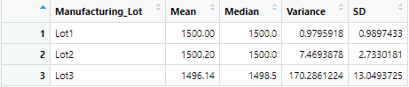
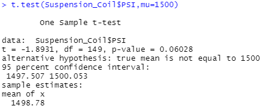
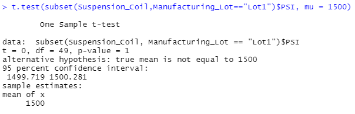
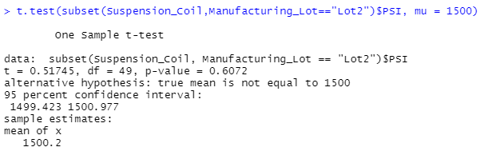
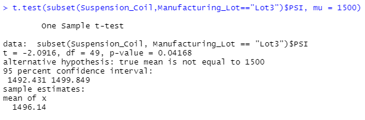

# MechaCar_Statistical_Analysis

## Overview

This project is created to assist AutosRUs' management team to determine the possible causes of production troubles that are blocking manufacturing team's progress. In this project the following tests have been performed:

- multiple linear regression analysis to identify which variables in the dataset predict the mpg of MechaCar prototypes
- Collect summary statistics on the pounds per square inch (PSI) of the suspension coils from the manufacturing lots
- Run t-tests to determine if the manufacturing lots are statistically different from the mean population
- Design a statistical study to compare vehicle performance of the MechaCar vehicles against vehicles from other manufacturers.

## Results

### Linear Regression to Predict MPG

The `MechaCar_mpg.csv` dataset contains mpg test results for 50 prototype MechaCars. The MechaCar prototypes were produced using multiple design specifications to identify ideal vehicle performance. Multiple metrics, such as vehicle length, vehicle weight, spoiler angle, drivetrain, and ground clearance, were collected for each vehicle. Here is a linear model that predicts the mpg of MechaCar prototypes using several variables from the `MechaCar_mpg.csv` file. 

- Which variables/coefficients provided a non-random amount of variance to the mpg values in the dataset?

  *According to the summary statistics, vehicle length and ground_clearance(as well as intercept) are statistically unlikely to provide random amounts of variance to the linear model. In other words, vehicle length and ground_clearance have a significant impact on mpg.*

- Is the slope of the linear model considered to be zero? Why or why not?

  *The p-value = 5.35 x 10**(-11) which is much smaller than the significance level of 0.05. Therefore, there is sufficient evidence to reject our null hypothesis, which means that the slope of our linear model is not zero.*

- Does this linear model predict mpg of MechaCar prototypes effectively? Why or why not?

  *The r-squared value = 0.7149 which means roughly 71% of the variability of our dependent variable (mpg) is explained using this linear model. This analysis predicts mpg of MechaCar prototype effectively.*

### Summary Statistics on Suspension Coils

The MechaCar `Suspension_Coil.csv` dataset contains the results from multiple production lots. In this dataset, the weight capacities of multiple suspension coils were tested to determine if the manufacturing process is consistent across production lots. Create a summary statistics table to show:

- The suspension coil’s PSI continuous variable across all manufacturing lots

  

- The following PSI metrics for each lot: mean, median, variance, and standard deviation.

- The design specifications for the MechaCar suspension coils dictate that the variance of the suspension coils must not exceed 100 pounds per square inch. Does the current manufacturing data meet this design specification for all manufacturing lots in total and each lot individually? Why or why not?

  *The variance for all manufacturing lot is 62.29 which is less than 100 and meets the design specifications requirement.* 

  *When reviewing the data for each lot number, we find that there is significant difference between variances.  Lot1 variance is 0.98 and Lot2 variance is 7.47 which is much smaller than 100 pounds per square inch, but Lot3 variance is 170.28 which is way greater than 100 PSI and does not meet the design specification.*

### T-Tests on Suspension Coils

Perform t-tests to determine if all manufacturing lots and each lot individually are statistically different from the population mean of 1,500 pounds per square inch.

- The overall manufacturing lot t-test statistics

shows that p-value = 0.06028 > 0.05 (significance value). That means we **do not** have sufficient evidence to reject the null hypothesis, and we would state that the all manufacturing lots *are statistically similar* to  the population mean of 1,500 pounds per square inch.

- The manufacturing lot1 t-test statistics

shows that p-value = 1 > 0.05 (significance value). That means we **do not** have sufficient evidence to reject the null hypothesis, and we would state that lot1 *is statistically similar* to the population mean of 1,500 pounds per square inch.

- The manufacturing lot2 t-test statistics

shows that p-value = 0.06072 > 0.05 (significance value). That means we **do not** have sufficient evidence to reject the null hypothesis, and we would state that lot2 *is statistically similar* to the population mean of 1,500 pounds per square inch.

- The manufacturing lot3 t-test statistics

shows that p-value = 0.04168 < 0.05 (significance value). That means we **do** have sufficient evidence to  reject the null hypothesis, and we would state that lot3 *is statistically different* from the population mean of 1,500 pounds per square inch.